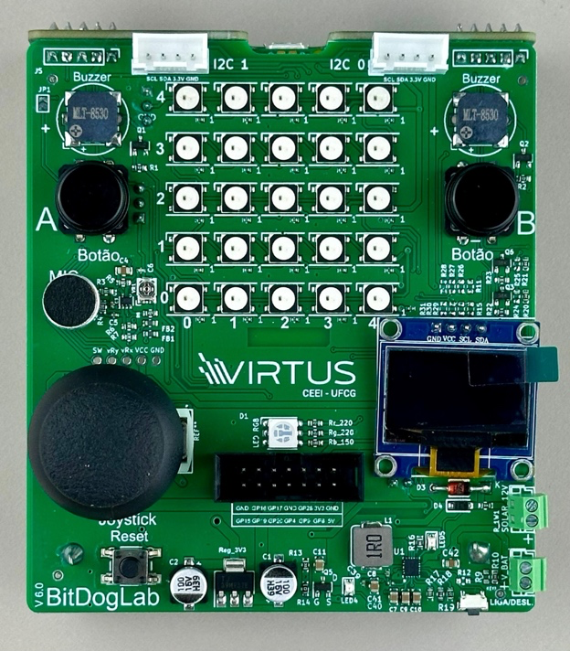
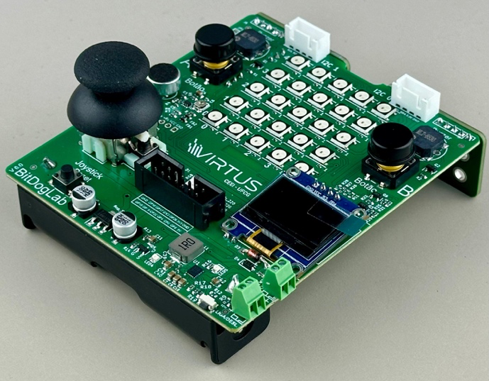

# Projeto de Controle do microfone - VIRTUS-CC

  

## Autores

- [Antonio Roberto](https://github.com/antoniojunior2222)
- [Ismael Marinho](https://github.com/smalljooj)

Este projeto implementa visualização de áudio em tempo real em uma matriz LED 5x5 usando um microfone. O sistema captura entrada de áudio, processa a amplitude do sinal e exibe padrões dinâmicos nos LEDs. Desenvolvido para Raspberry Pi Pico usando as bibliotecas `mic` e `malha_led`.

## Montagem do Projeto

### Componentes Utilizados

- 1x Placa Bitdoglab
- 1x Microfone Analógico (MAX4466)
- 1x Matriz LED 5x5 (WS2812B/NeoPixel)
- 1x Botão Opcional (GPIO 5 para controle de cores)

### Conexões

- **Microfone**:
  - Saída Analógica: GPIO 28 (ADC2)
  - VCC: 3.3V
  - GND: GND
- **Matriz LED**:
  - Dados: GPIO 7

## Funções Implementadas com Bibliotecas

## Biblioteca do Microfone (`mic`)

A biblioteca `mic` gerencia amostragem de áudio, calibração de offset DC e normalização do sinal.

#### Funções Principais:

1. **`void init_mic(uint16_t sample_rate)`**
   - Inicializa hardware do microfone e ADC
   - Define taxa de amostragem (amostras/segundo)
   - Realiza calibração automática de offset DC

2. **`float read_mic()`**
   - Captura uma única amostra de áudio
   - Retorna valor normalizado [-1.0, 1.0]

3. **`void record_mic(uint16_t seconds)`**
   - Grava áudio por tempo especificado
   - Armazena amostras em buffer alocado dinamicamente

4. **`float* get_samples_mic()`**
   - Retorna ponteiro para o buffer de amostras

5. **`void calculate_offset()`**
   - Calibra o offset DC.

6. **`void deinit_mic()`**
   - Libera memória do buffer de áudio

---

### **Biblioteca da Matriz de LED (`malha_led`)**

A biblioteca `malha_led` controla uma matriz de LED 5x5, permitindo a exibição de sprites e a alteração dinâmica das cores.

#### Funções Principais:

1. **`void npInit()`**
   - **Descrição**: Inicializa a matriz de LED, configurando o PIO e a máquina de estados.
   - **Detalhes**:
     - Configura o pino 7 para controle dos LEDs NeoPixel.
     - Inicializa o buffer de pixels com todas as cores definidas como preto.

2. **`void npSetLED(uint index, uint8_t intensidade)`**
   - **Descrição**: Define a cor de um LED específico na matriz.
   - **Parâmetros**:
     - `index`: Índice do LED (0 a 24).
     - `intensidade`: Intensidade do LED (0-255), que é multiplicada pela cor tema.

3. **`void npClear()`**
   - **Descrição**: Limpa a matriz de LED, definindo todas as cores como preto.
   - **Detalhes**:
     - Útil para reiniciar a exibição antes de desenhar um novo sprite.

4. **`void npWrite()`**
   - **Descrição**: Envia os dados do buffer de pixels para os LEDs.
   - **Detalhes**:
     - Deve ser chamada após definir as cores dos LEDs para atualizar a matriz.

5. **`void display_sprite(const int sprite[5][5][3])`**
   - **Descrição**: Exibe um sprite na matriz de LED.
   - **Parâmetros**:
     - `sprite`: Matriz 5x5x3 contendo os valores de intensidade para cada LED.

6. **`int getIndex(int x, int y)`**
   - **Descrição**: Converte coordenadas (x, y) em um índice linear.
   - **Retorno**: Índice linear correspondente (0 a 24).

---

## Funções de Teste Implementadas

## Funções Implementadas no `main`

O arquivo main.c é o ponto de entrada do projeto. Ele integra as bibliotecas do microfone e da matriz de LED, implementando a lógica principal do projeto.

### **Lógica Principal**

1. O nível de áudio é lido continuamente.

2. A matriz de LED é atualizada para exibir sprites com base na intensidade sonora.

3. Controle de Sprites:
    - Níveis de som baixos exibem um sprite de "silêncio".
    - Níveis médios exibem um sprite "padrão".
    - Níveis altos exibem um sprite "explosivo".

4. Atualização da Matriz:
    - Após definir o sprite, a função npWrite() é chamada para atualizar a matriz de LED.

---

## Instruções

### Como Compilar e Executar

1. **Requisitos**:
   - Visual Studio Code
   - Extensão Rapsberry Pi Pico

2. **Compilação**:
   - Importe o projeto pela interface da extensão e coloque a versão 1.5.1

3. **Execução**:
   - Conecte a Raspberry Pi Pico ao computador via USB.
   - Carregue o arquivo `.uf2` gerado na Pico, ou instale o zadig para executar diretamente do VSCode.

4. **Interação**:
   - Fale ou coloque um som próximo ao microfone.

---

## Conclusão

Este projeto demonstra a integração de um microfone com uma matriz de LED, permitindo a visualização dinâmica dos níveis de áudio em tempo real. Possíveis melhorias incluem a adição de filtros de áudio, suporte a mais efeitos visuais e a integração de outros sensores.

---

## Fontes

- [Raspberry Pi Pico SDK](https://github.com/raspberrypi/pico-sdk)
- [Biblioteca NeoPixel para Pico](https://github.com/raspberrypi/pico-examples/tree/master/pio/ws2812)
